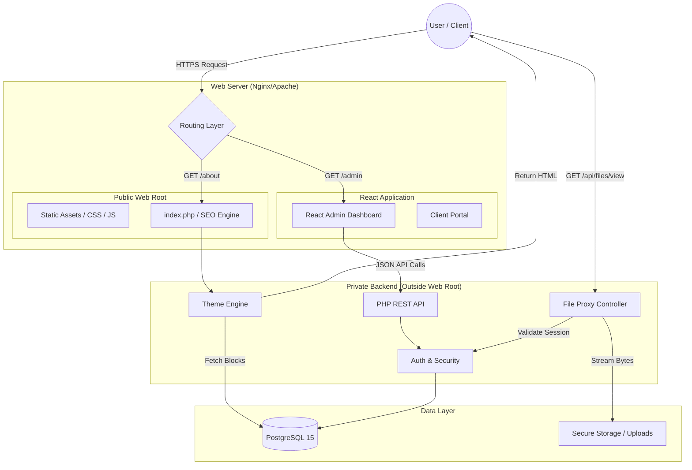

# ClarityStack


**ClarityStack** is a modern, photographer‑first platform that makes managing, sharing, and delivering work feel effortless. Built for studios and creative teams, it blends a secure, behind‑the‑scenes engine with a fast, intuitive dashboard—so you can focus on creating, not wrestling with software. From client proofing to project management, everything stays clean, simple, and confidently under your control.

🌐 **Website:** [iangordon.app/claritystack](https://iangordon.app/claritystack)  
👨‍💻 **Author:** Ian Gordon

---

## 🏗️ Architectural Overview

ClarityStack utilizes a **Hybrid Monolith** architecture. It serves public marketing pages via Server-Side Rendering (SSR) for optimal SEO, while the Admin Dashboard and Client Portal run as a React Single Page Application (SPA).



---

## 🚀 Key Features

### 🎨 Hybrid Theme Engine

* **Performance:** Public marketing pages (Home, Portfolio, Pricing) are server-side rendered (SSR) via PHP for 100/100 Lighthouse SEO scores.
* **Reactivity:** The Admin Dashboard and Client Portal operate as a Single Page Application (SPA) using React for a fluid user experience.
* **Recursive Block Builder:** A drag-and-drop page builder that allows nested layouts (e.g., Columns inside Containers) with a robust "Safety Net" that prevents white-screen crashes.

### 📸 Secure Client Proofing

* **IDOR Protection:** High-resolution original files are stored **outside** the web root. Access is proxied via a secure PHP controller that verifies session ownership before streaming bytes.
* **Magic Links:** Passwordless authentication for clients via secure, time-bound email links.
* **Secure Downloads:** Large ZIP downloads are generated on-the-fly and streamed via signed, one-time-use URLs to prevent memory exhaustion and unauthorized sharing.

### 💰 Studio Management

* **Stripe Integration:** Automated booking flow with webhook verification (Signature & Idempotency checks).
* **EXIF Extraction:** Automatically extracts camera, lens, and exposure data from uploaded JPEGs for display.
* **Dynamic Watermarking:** (Optional) On-the-fly watermark injection for unpaid proofing galleries.

---

## 🛠️ Tech Stack

* **Backend:** PHP 8.2+ (PSR-4 Autoloading, No Heavy Frameworks)
* **Frontend:** React 18, TailwindCSS, Vite
* **Database:** PostgreSQL 15 (JSONB used for flexible Content Blocks)
* **Infrastructure:** Docker-ready, Local Filesystem or S3 Storage Adapters

---

## 📂 Directory Structure

```text
ClarityStack/
├── api/                  # PHP Core & Controllers
│   ├── core/             # ThemeEngine, Security, Database
│   └── controllers/      # API Endpoints
├── themes/               # CMS Themes
│   └── clarity_default/  # The default 'Ian Gordon Photography' theme
├── src/                  # React Admin Dashboard (Source)
├── public/               # Web Root (Entry Point)
├── storage_secure/       # Private Uploads (Outside Web Root)
└── database/             # SQL Schema & Migrations

```

---

## 📦 Installation

### Prerequisites

* PHP 8.2 (Extensions: `pgsql`, `gd`, `mbstring`, `zip`)
* PostgreSQL 15+
* Node.js 18+ (for building the frontend assets)

### Quick Start

1. **Clone the Repo**
```bash
git clone [https://github.com/your-username/claritystack.git](https://github.com/your-username/claritystack.git)

```


2. **Install Dependencies**
```bash
# Backend
cd clarity_app
composer install

# Frontend
cd ../src
npm install && npm run build

```


3. **Setup Database**
Create a secure PostgreSQL database and user.
4. **Run Installer**
Navigate to `your-domain.com/install` to launch the Setup Wizard. This will:
* Generate the secure `env.php` configuration.
* Run database migrations.
* Create your Super Admin account.


---

## 📄 License

**The MIT License (MIT)**

Copyright (c) 2026 Ian Gordon

Permission is hereby granted, free of charge, to any person obtaining a copy
of this software and associated documentation files (the "Software"), to deal
in the Software without restriction, including without limitation the rights
to use, copy, modify, merge, publish, distribute, sublicense, and/or sell
copies of the Software, and to permit persons to whom the Software is
furnished to do so, subject to the following conditions:

The above copyright notice and this permission notice shall be included in all
copies or substantial portions of the Software.

THE SOFTWARE IS PROVIDED "AS IS", WITHOUT WARRANTY OF ANY KIND, EXPRESS OR
IMPLIED, INCLUDING BUT NOT LIMITED TO THE WARRANTIES OF MERCHANTABILITY,
FITNESS FOR A PARTICULAR PURPOSE AND NONINFRINGEMENT. IN NO EVENT SHALL THE
AUTHORS OR COPYRIGHT HOLDERS BE LIABLE FOR ANY CLAIM, DAMAGES OR OTHER
LIABILITY, WHETHER IN AN ACTION OF CONTRACT, TORT OR OTHERWISE, ARISING FROM,
OUT OF OR IN CONNECTION WITH THE SOFTWARE OR THE USE OR OTHER DEALINGS IN THE
SOFTWARE.

```

```
